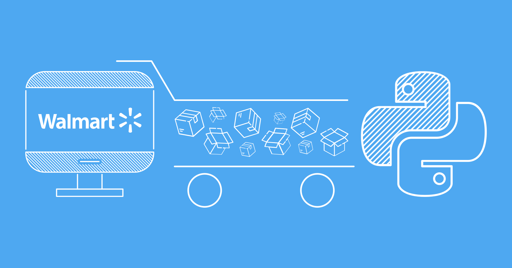

# Walmart Product Scraper — How This Code Works (Step-by-Step Technical Walkthrough)

This scraper is a well-structured Python script that programmatically extracts detailed product information from Walmart.com. Here’s exactly how it operates:

---

## 1. Initialization & Configuration

- **Base URL & Output**: Sets Walmart’s base URL and output files for storing product data (`product_info.jsonl`) and failed URLs (`failed_urls.txt`).
- **User-Agent List**: Contains multiple real browser User-Agent strings. Each HTTP request uses a random User-Agent to mimic genuine traffic and reduce blocking risk.
- **Search Queries**: A list of product keywords (like "laptops", "smart watch", "xbox") representing categories or items to scrape.

---

## 2. Search Query & Pagination Loop

- The script processes each search query one by one.
- For each query, it starts scraping from page 1, incrementing the page number after processing each page, up to a maximum of 99 pages.
- For every search results page, it constructs a URL like:  
  `https://www.walmart.com/search?q={query}&page={page_number}`

---

## 3. Extracting Product Links

- Sends a **GET** request to the search page with randomized headers.
- Parses the HTML using **BeautifulSoup**.
- Finds all `<a>` tags where the href contains `/ip/`, which uniquely identifies product pages on Walmart.
- Filters out URLs already seen to avoid duplicates.
- Collects all new product URLs into a queue for detailed scraping.

---

## 4. Detailed Product Data Extraction

For each product URL:

- Sends another **GET** request with a randomized User-Agent.
- Parses the product page HTML, specifically looking for a `<script id="__NEXT_DATA__">` tag that contains product metadata as JSON.
- Loads this JSON and extracts key product fields including:
  - Price (`currentPrice.price`)
  - Review count and average rating
  - Product name and brand
  - Availability status
  - Thumbnail image URL
  - Short description

---

## 5. Robust Error Handling & Retries

- Uses up to 5 retries per request with exponential backoff delays (`3^attempt` seconds).
- Specifically handles HTTP `412 Precondition Failed` errors by skipping that URL to avoid infinite loops.
- Logs failed URLs to `failed_urls.txt` for later review.
- If errors persist after retries, the scraper gracefully skips the problematic URL or query.

---

## 6. Polite Scraping Practices

- Introduces random delays of 1 to 3 seconds between requests to avoid overwhelming Walmart servers.
- Rotates User-Agent headers to simulate different browsers and devices.
- Tracks and skips already processed URLs to avoid redundant requests.

---

## 7. Output Format

- Writes product data incrementally to a JSON Lines file (`product_info.jsonl`), where each line is a valid JSON object.
- This format is ideal for easy parsing, database import, or feeding into downstream analytics or ML pipelines.

---

## Summary

This scraper intelligently:

- Navigates Walmart’s search pages for multiple queries and paginations.
- Extracts product URLs dynamically without hardcoded links.
- Parses structured JSON data embedded in product pages for accurate and rich metadata.
- Handles network or server errors with retries and logging.
- Uses anti-blocking strategies like User-Agent rotation and randomized delays.
- Produces clean, structured, and scalable output ideal for commercial or research use.

---

*This approach ensures the scraper is both powerful and resilient, providing reliable data collection for large-scale Walmart product datasets.*

